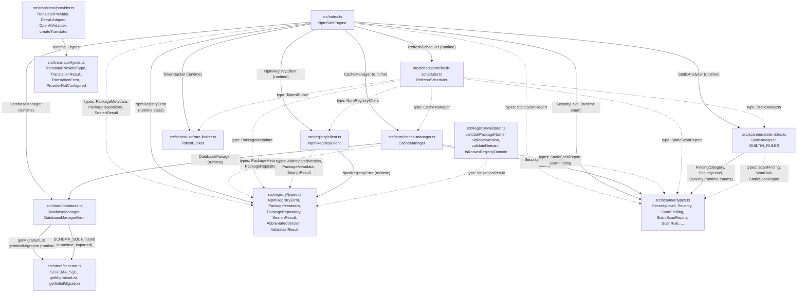

# @npm-safe/core Architecture Document

**Phase 1** | `@npm-safe/core` v0.1.0

---

## 1. Layer Map

The package is composed of five source layers and one supporting module. Each
layer lives in its own directory under `src/` and owns a single concern.

| Layer | Directory | Responsibility | Entry Point |
|-------|-----------|----------------|-------------|
| Registry | `src/registry/` | NPM registry HTTP client. Fetches packuments, version manifests, and search results from the public npm registry API v2. Retries with exponential backoff, enforces request timeouts, and surfaces non-2xx responses as typed errors. | `client.ts` (class `NpmRegistryClient`) |
| Scanner | `src/scanner/` | Static analysis engine. Runs a battery of regex-based rules against a package's README and package.json to detect supply-chain risks (install scripts, obfuscation, secret exposure, typosquatting, homograph attacks, etc.). Produces findings with severity weights and an aggregate score. | `static-rules.ts` (class `StaticAnalyzer`) |
| Scheduler | `src/scheduler/` | Refresh orchestration and rate limiting. A token-bucket rate limiter gates outbound registry calls; the refresh scheduler periodically re-fetches watched packages, re-runs the analyzer, and surfaces progress via three typed events (`refresh:start`, `refresh:complete`, `refresh:error`). | `refresh-scheduler.ts` (class `RefreshScheduler`), `rate-limiter.ts` (class `TokenBucket`) |
| Store | `src/store/` | SQLite persistence. Owns the `better-sqlite3` connection, runs WAL-mode pragmas, applies ordered migrations from DDL defined in `schema.ts`, and provides typed cache accessors (package metadata, security reports, watchlist, settings). | `database.ts` (class `DatabaseManager`), `cache-manager.ts` (class `CacheManager`) |
| Facade | `src/index.ts` | `NpmSafeEngine` — a single class that composes all four layers above. Exposes the full public API: `checkPackage`/`checkPackages`, `searchPackages`, watchlist CRUD, `refreshPackage`/`refreshAll`, `startAutoRefresh`/`stopAutoRefresh`, settings, rule management, LLM configuration, check history, and lifecycle (`close`). | `index.ts` |

**Supporting module: `src/translator/`** — i18n provider interface and skeleton
adapters for DeepL and OpenAI-compatible APIs. Defined in Phase 1 as interface
contracts only; all `translate()` calls throw `TranslationError` with "not yet
implemented" until Phase 5.

---

## 2. Module Dependency Graph

The following Mermaid diagram captures every `import` relationship originating
from `index.ts` and the transitive imports across all layers. Runtime imports
(classes) use solid arrows; type-only imports use dashed arrows.



**Key observations:**

- `ScannerTypes` (`src/scanner/types.ts`) is the most widely imported module —
  4 consumers (index, cache-manager, static-rules, refresh-scheduler).
- `RegistryTypes` (`src/registry/types.ts`) is imported by 5 consumers.
- `rate-limiter.ts` has zero local imports: it is a standalone utility.
- `schema.ts` has zero local imports: it is a pure SQL-string module.
- `refresh-scheduler.ts` imports collaborators as **types only** (constructor
  injection); it never instantiates them directly.

---

## 3. Data Flow, Hot Path: `checkPackage(name)`

`NpmSafeEngine.checkPackage(name: string): Promise<CheckResult>` is the primary
read path. The flow branches on cache hit versus cache miss.

### 3.1. Cache Hit

```
checkPackage("lodash")
    │
    ├─ cache.getPackage("lodash")
    │      SELECT ... FROM packages
    │      WHERE name = ? AND ttl_until >= datetime('now')
    │      ── row found, parse registry_data JSON ──► PackageMetadata
    │
    ├─ latestVersion = meta["dist-tags"].latest
    │
    ├─ cache.getSecurityReport("lodash", latestVersion)
    │      SELECT ... FROM security_reports
    │      WHERE package_name = ? AND version = ? AND scan_type = 'static'
    │      ── row found, parse findings_json, reconstruct SecurityLevel via scoreToLevel()
    │      ──► StaticScanReport | null
    │
    └─ buildCheckResult(...)
         return CheckResult {
           exists: true,
           latestVersion,
           security: { overallLevel, overallScore, staticScan },
           registryInfo: { description, homepage, repository },
           cachedAt: null,   // exact timestamp unknown on cache hit
         }
```

### 3.2. Cache Miss (or Stale)

```
checkPackage("lodash")   [cache miss or expired TTL]
    │
    ├─ client.getPackageMetadata("lodash")
    │      GET https://registry.npmjs.org/lodash
    │      ──► PackageMetadata (full packument)
    │
    ├─ latestVersion = meta["dist-tags"].latest
    │
    ├─ cache.setPackage(meta)
    │      INSERT INTO packages (...)
    │      ON CONFLICT(name) DO UPDATE SET ...
    │      TTL = now + cacheTtlMs (default 1 hour)
    │
    ├─ manifest = meta.versions[latestVersion]
    │      ──► AbbreviatedVersion (readonly interface)
    │
    ├─ packageJson = { ...manifest } as unknown as Record<string, unknown>
    │      │  Spread + double-cast: AbbreviatedVersion is readonly,
    │      │  so we must cast through `unknown` to reach a mutable
    │      │  plain-object shape the analyzer can consume.
    │
    ├─ report = analyzer.analyze(readme, packageJson)
    │      │  Runs 10 built-in rules over README + derived package.json.
    │      │  Computes score = 100 - sum(severity weights per finding).
    │      │  Clamps to [0, 100]. Maps score to SecurityLevel.
    │      ──► StaticScanReport
    │
    ├─ cache.setSecurityReport(report)
    │      INSERT INTO security_reports (...)
    │      ON CONFLICT(package_name, version, scan_type) DO UPDATE SET ...
    │
    └─ buildCheckResult(...)
         return CheckResult {
           exists: true,
           latestVersion,
           security: { overallLevel, overallScore, staticScan: report },
           registryInfo: { description, homepage, repository },
           cachedAt: new Date().toISOString(),
         }
```

### 3.3. HTTP 404 Path

When `client.getPackageMetadata(name)` throws `NpmRegistryError` with
`statusCode === 404`, the engine catches it and returns a graceful "not found"
result:

```
CheckResult {
  packageName: "non-existent-pkg",
  exists: false,
  latestVersion: "",
  security: { overallLevel: SecurityLevel.Unknown, overallScore: 0, staticScan: null },
  registryInfo: null,
  cachedAt: null,
}
```

All other errors (network failure, timeout, 5xx) propagate to the caller
unwrapped.

---

## 4. Data Flow, Refresh Path

### 4.1. Auto-Refresh Lifecycle

```
engine.startAutoRefresh(intervalMs)
    │
    └─ scheduler.start(intervalMs)
           │
           ├─ clearInterval(previous)   // safe to call when not running
           │
           ├─ void this.refreshWatchlist()   // kick off first cycle immediately
           │
           └─ this.intervalId = setInterval(() => {
                  void this.refreshWatchlist();   // subsequent cycles
              }, intervalMs)
```

### 4.2. Refresh Cycle Detail

```
refreshWatchlist()
    │
    ├─ cache.getWatchlist()
    │      SELECT package_name FROM watchlist ORDER BY added_at ASC
    │      ──► string[]   (package names)
    │
    └─ for each name (sequential):
           │
           └─ refreshPackage(name)
                  │
                  ├─ emit("refresh:start", { packageName: name })
                  │
                  ├─ await limiter.consume(1)     // gate through rate limiter
                  │      │  TokenBucket: refill every 100ms based on wall-clock
                  │      │  elapsed. FIFO queue for concurrent consumers.
                  │
                  ├─ client.getPackageMetadata(name)
                  │      GET https://registry.npmjs.org/{name}
                  │      ──► PackageMetadata
                  │
                  ├─ cache.setPackage(meta)       // persist fresh packument
                  │
                  ├─ manifest = meta.versions[latestVersion]
                  │  packageJson = { ...manifest } as unknown as Record<string, unknown>
                  │  report = analyzer.analyze(readme, packageJson)
                  │      ──► StaticScanReport
                  │
                  ├─ cache.setSecurityReport(report)
                  │
                  └─ emit("refresh:complete", { packageName: name, report })
                         │
                         └─ on error:
                               emit("refresh:error", { packageName: name, error })
                               // never rejects the batch promise
```

### 4.3. Sequential Processing Guarantee

Both `refreshAll()` and `refreshWatchlist()` use `for...of` with `await` inside
the loop. This ensures exactly one in-flight registry call at a time. The rate
limiter's token bucket provides a second gate: even if `refreshAll()` and
`refreshWatchlist()` were called concurrently, the `consume(1)` calls would
serialize through the FIFO queue.

### 4.4. Event Contract

| Event | Payload | When |
|-------|---------|------|
| `refresh:start` | `{ packageName: string }` | Before the rate-limiter gate for each package. |
| `refresh:complete` | `{ packageName: string, report: StaticScanReport }` | After the scan report is persisted. |
| `refresh:error` | `{ packageName: string, error: unknown }` | On any failure. The refresh continues to the next package. |

---

## 5. Database Schema

The database contains six application tables plus the internal `_migrations`
tracking table. All DDL is declared in `src/store/schema.ts` as the
`SCHEMA_SQL` constant and wrapped in `CREATE TABLE IF NOT EXISTS` statements
for idempotency.

### 5.1. Entity-Relationship Diagram

```
┌─────────────────────────────────────────────────────────────────────────────┐
│                                                                             │
│  packages                                                                   │
│  ─────────                                                                  │
│  PK  name                    TEXT                                           │
│      latest_version          TEXT        NOT NULL                           │
│      description             TEXT        DEFAULT ''                         │
│      homepage                TEXT        DEFAULT ''                         │
│      repository              TEXT        DEFAULT ''                         │
│      registry_data           TEXT        DEFAULT '{}'   -- JSON blob       │
│      cached_at               TEXT        NOT NULL        -- datetime('now')│
│      ttl_until               TEXT        NOT NULL        -- expiry ts       │
│                                                                             │
│      1                                                                      │
│      │                                                                      │
│      │ *                                                                   │
├──────┼──────────────────────────────────────────────────────────────────────┤
│      │                          package_versions                            │
│      │                          ─────────────────                           │
│      │                 PK,FK  package_name  TEXT        NOT NULL             │
│      │                 PK      version       TEXT        NOT NULL            │
│      │                         publish_time  TEXT                            │
│      │                         has_readme    INTEGER     NOT NULL DEFAULT 0 │
│      │                         integrity     TEXT                            │
│      │                                                                      │
│      │                                                                      │
│      │ *                                                                    │
├──────┼──────────────────────────────────────────────────────────────────────┤
│      │                          security_reports                            │
│      │                          ─────────────────                           │
│      │                 PK      id            INTEGER     AUTOINCREMENT      │
│      │                 FK      package_name  TEXT        NOT NULL            │
│      │                         version       TEXT        NOT NULL            │
│      │                         scan_type     TEXT        NOT NULL            │
│      │                         overall_score INTEGER     NOT NULL            │
│      │                         findings_json TEXT        DEFAULT '[]'       │
│      │                         summary       TEXT        DEFAULT ''         │
│      │                         scanned_at    TEXT        NOT NULL            │
│      │                                                                      │
│      │              UNIQUE(package_name, version, scan_type)                │
│      │              CHECK(scan_type IN ('static', 'llm'))                   │
│      │              CHECK(overall_score >= 0 AND overall_score <= 100)      │
│      │                                                                      │
│      │                                                                      │
│      │ * (via watchlist.package_name)                                       │
├──────┼──────────────────────────────────────────────────────────────────────┤
│      │                          watchlist                                   │
│      │                          ─────────                                   │
│      │                 PK,FK  package_name  TEXT                             │
│      │                         added_at      TEXT  NOT NULL                 │
│      │                                                                      │
│      └──────────────────────────────────────────────────────────────────────┘
│                                                                             │
│  ┌────────────────────────────────────┐   ┌──────────────────────────────┐  │
│  │  settings                          │   │  translations                │  │
│  │  ────────                          │   │  ────────────                 │  │
│  │  PK  key      TEXT                 │   │  PK  source_hash    TEXT      │  │
│  │      value    TEXT  NOT NULL       │   │      source_text    TEXT  NN  │  │
│  └────────────────────────────────────┘   │      target_lang    TEXT  NN  │  │
│                                           │      translated_text TEXT  NN │  │
│  ┌────────────────────────────────────┐   │      provider       TEXT  NN  │  │
│  │  _migrations (internal)            │   │      created_at     TEXT  NN  │  │
│  │  ────────────────────────────      │   │                              │  │
│  │  PK  id          INTEGER  AI      │   │  INDEX idx_translations_lang  │  │
│  │  UNIQUE  name    TEXT  NOT NULL   │   │        ON(target_lang)        │  │
│  │          applied_at TEXT  NOT NULL │   └──────────────────────────────┘  │
│  └────────────────────────────────────┘                                    │
│                                                                             │
│  ┌──────────────────────────────────────────────────────────────────────┐  │
│  │  check_history  (migration 002)                                     │  │
│  │  ───────────────────────────────                                    │  │
│  │  PK  id           INTEGER  AUTOINCREMENT                            │  │
│  │      package_name TEXT     NOT NULL                                 │  │
│  │      level        TEXT     NOT NULL                                 │  │
│  │      score        INTEGER  NOT NULL  CHECK(0..100)                  │  │
│  │      timestamp    TEXT     NOT NULL                                 │  │
│  │  INDEX idx_check_history_timestamp ON(timestamp DESC)               │  │
│  └──────────────────────────────────────────────────────────────────────┘  │
└─────────────────────────────────────────────────────────────────────────────┘
```

### 5.2. Key Schema Decisions

**`packages.registry_data`** stores the full packument JSON blob. Scalar
columns (`latest_version`, `description`, `homepage`, `repository`) are
denormalized for cheap listing queries without JSON parsing.

**`package_versions`** stores per-version metadata. The composite primary key
`(package_name, version)` matches the natural access pattern (latest version
first). No foreign key cascade is defined here in the DDL, though
`packages.name` is the logical parent.

**`security_reports`** stores only the numeric `overall_score` (0-100). The
`SecurityLevel` enum is reconstructed at read time via `scoreToLevel()`. The
`scan_type` CHECK constraint restricts values to `'static'` or `'llm'`. A
UNIQUE constraint on `(package_name, version, scan_type)` prevents duplicate
scans of the same type for the same version. Both `package_name` and
`version` are NOT NULL but no FK constraint is declared in the DDL; referential
integrity is enforced at the application layer.

**`watchlist`** references `packages(name)` via a foreign key with
`ON DELETE CASCADE`. Removing a package from the `packages` table
automatically cleans up its watchlist entry.

**`translations`** uses `source_hash` (a hash of `source_text + target_lang +
provider`) as the primary key for idempotent inserts. An index on
`target_lang` supports language-based lookups.

---

## 6. Migration System

The migration runner is implemented in `DatabaseManager` (`src/store/database.ts`).

### 6.1. Migration Source

- `SCHEMA_SQL` in `src/store/schema.ts` contains the full DDL for all 8 tables
  (7 application + `_migrations`), wrapped in `CREATE TABLE IF NOT EXISTS`.
- `getMigrationList()` returns `['001_initial.sql', '002_check_history.sql']`
  in ordered insertion order. Future migrations append to this array.
- `getInitialMigration()` returns the same DDL as `SCHEMA_SQL`, wrapped so the
  runner can record it under the `001_initial.sql` name.
- `getCheckHistoryMigration()` (migration `002`) creates the `check_history`
  table (and its timestamp index) for the shared CLI/GUI check history.

### 6.2. Runner Algorithm (`DatabaseManager.runMigrations()`)

```
1. Create the _migrations tracking table idempotently
   (safety net: also part of SCHEMA_SQL, but created first so that
    the very first migration can be recorded even on an empty schema).

2. Prepare two statements:
   - SELECT name FROM _migrations WHERE name = ?   (identity check)
   - INSERT INTO _migrations (name) VALUES (?)       (record)

3. For each name in getMigrationList():
   a. Query _migrations for existing entry.
   b. If found → skip (already applied).
   c. If not found:
      i.   getMigrationSql(name) → maps to getInitialMigration()
      ii.  db.transaction() { db.exec(sql); insertMigration.run(name); }
      iii. On failure → wrap in DatabaseManagerError and throw.

The _migrations CREATE TABLE statement at the start of runMigrations()
is redundant with SCHEMA_SQL (which also creates it), but is necessary
because SCHEMA_SQL is not executed until the '001_initial.sql' migration
runs. Without this preliminary CREATE, the SELECT check in step 3a would
fail on a fresh database.
```

### 6.3. Migration SQL Resolution

```typescript
function getMigrationSql(name: string): string {
  switch (name) {
    case "001_initial.sql":
      return getInitialMigration();   // SCHEMA_SQL
    case "002_check_history.sql":
      return getCheckHistoryMigration(); // check_history table
    default:
      throw new DatabaseManagerError(`Unknown migration: ${name}`);
  }
}
```

New migrations add a `case` entry in this function.

---

## 7. Error Taxonomy

### 7.1. `DatabaseManagerError` (`store/database.ts`)

Thrown when the underlying `better-sqlite3` operation fails: open, pragma
application, migration execution, or close. Wraps the original cause.

```
class DatabaseManagerError extends Error
  name:    "DatabaseManagerError"
  cause:   unknown   // the underlying error (optional)
```

Thrown by:
- `constructor(dbPath)` — open failure
- `applyPragmas()` — pragma execution failure
- `runMigrations()` — migration SQL execution failure
- `getDb()` — connection already closed
- `close()` — underlying close failure

### 7.2. `NpmRegistryError` (`registry/types.ts`)

Thrown by `NpmRegistryClient` when a registry request fails after exhausting
all retry attempts, or returns a non-2xx response. Carries the HTTP status
code and status text for caller-side branching (e.g. 404 handling).

```
class NpmRegistryError extends Error
  name:       "NpmRegistryError"
  statusCode:  number | undefined   // HTTP status code
  statusText:  string | undefined   // HTTP status text
```

Thrown by:
- `NpmRegistryClient.request()` — all attempts exhausted
- `NpmRegistryClient.request()` — timeout (surfaced as `NpmRegistryError`)
- `NpmRegistryClient.request()` — non-2xx response on final attempt

### 7.3. CacheManager Runtime Errors

`CacheManager` does not define a custom error class. Methods that access the
database through `DatabaseManager.getDb()` will throw `DatabaseManagerError`
if the connection has been closed:

```
cache.getPackage(name)      → throws DatabaseManagerError("Database is not open")
cache.setPackage(meta)      → throws DatabaseManagerError("Database is not open")
cache.getSecurityReport(...) → throws DatabaseManagerError("Database is not open")
// etc.
```

### 7.4. TokenBucket Runtime Errors

- `consume()` throws `Error("TokenBucket has been disposed")` when the bucket
  is disposed.
- `tryConsume()` returns `false` when disposed (no throw).
- Constructor throws `RangeError` for invalid `tokensPerSecond` or `maxBurst`
  values (non-positive or non-finite).

### 7.5. Translator Errors (`translator/types.ts` — Phase 1 skeleton)

```
class ProviderNotConfigured extends Error
class TranslationError extends Error
  provider:   string
  statusCode: number | undefined
```

Both throw with "not yet implemented" messages until Phase 5.

---

## 8. Design Decisions, Annotated

### 8.1. ReadonlySet is Type-Only in TypeScript

The `KNOWN_REGISTRY_DOMAINS` set in `validator.ts` is declared as
`ReadonlySet<string>` at the type level but constructed as `new Set(...)`:

```typescript
const KNOWN_REGISTRY_DOMAINS: ReadonlySet<string> = new Set<string>([...]);
```

TypeScript's `ReadonlySet` is a type utility that only prevents mutation
through the type system. At runtime, `new Set()` is used because there is no
`ReadonlySet` constructor in JavaScript. The type annotation signals intent
without requiring a wrapper or frozen proxy.

### 8.2. AbbreviatedVersion Requires Double-Cast for Spread

The npm registry's `PackageMetadata.versions` map contains
`AbbreviatedVersion` objects, which are `readonly` interfaces. When the engine
derives a plain `Record<string, unknown>` for the static analyzer, it cannot
spread a readonly type into a mutable one without an intermediate cast:

```typescript
const packageJson: Record<string, unknown> | undefined = manifest
  ? ({ ...manifest } as unknown as Record<string, unknown>)
  : undefined;
```

The spread (`{ ...manifest }`) creates a new plain object at runtime, but
TypeScript's structural type system still sees the `readonly` modifiers. The
double cast through `unknown` is the idiomatic escape hatch. The spread itself
is safe because `AbbreviatedVersion` contains only primitive and JSON-serializable
nested types — no class instances or getters are copied.

### 8.3. security_reports Stores Numeric Score Only

The `security_reports` table persists `overall_score` as an `INTEGER CHECK(0-100)`.
The `SecurityLevel` enum is not stored. On read, the `scoreToLevel()` function in
`cache-manager.ts` reconstructs the level using the same thresholds as the
analyzer:

| Score Range | Level |
|-------------|-------|
| 80-100      | Safe |
| 50-79       | Suspicious |
| 20-49       | Dangerous |
| 0-19        | Unknown |

This prevents the enum and the numeric score from drifting out of sync and
keeps the DB schema independent of enum variant ordering.

### 8.4. Sequential Refresh Rather Than Parallel

Both `refreshAll()` and `refreshWatchlist()` iterate with `for...of` and
`await` inside the loop, processing one package at a time. Parallel execution
was considered and rejected because:

- The token bucket rate limiter would serialize concurrent registry calls into
  FIFO order anyway, so parallel dispatch would not improve throughput.
- Sequential processing gives predictable backpressure: each step
  (fetch / persist / analyze / persist) completes before the next begins.
- Error isolation is simpler: a single `try/catch` per iteration with no
  `Promise.allSettled` orchestration.

### 8.5. tsc Invocation via pnpm Filter

Because the monorepo uses pnpm with isolated `node_modules` layouts, running
`npx tsc --noEmit` from the repository root fails to resolve `better-sqlite3`
type declarations correctly. The supported invocation is:

```
pnpm -F @npm-safe/core exec tsc --noEmit
```

This runs `tsc` within the package's own scope, where pnpm's linker has
correctly hoisted `@types/better-sqlite3` and `better-sqlite3` into
`packages/core/node_modules/`.

### 8.6. String Enums, Not Numeric Enums

All enum types (`SecurityLevel`, `Severity`, `ScanType`, `FindingCategory`,
`TranslatorProviderType`) are TypeScript string enums, not numeric enums.
String enums provide readable serialization (e.g., `'dangerous'` instead of
`2`) and survive JSON round-trips without a mapping layer. Numeric thresholds
and severity weights are defined as separate `const` values:

```typescript
const SEVERITY_WEIGHT: Readonly<Record<Severity, number>> = {
  [Severity.Critical]: 25,
  [Severity.High]: 15,
  [Severity.Medium]: 8,
  [Severity.Low]: 3,
};
```

This separation means the enum variants can be reordered or extended without
changing the scoring constants, and vice versa.

### 8.7. CacheManager Wraps Synchronous better-sqlite3 in async

All `CacheManager` public methods return `Promise<void>` or
`Promise<T | null>`, even though the underlying `better-sqlite3` calls are
synchronous. This is a deliberate API-surface decision:

- The facade layer (`NpmSafeEngine`) never needs to distinguish sync from
  async call patterns.
- A future migration to an async backing store (e.g., SQLite over HTTP, or a
  separate caching process) would not change any caller's code.

### 8.8. DatabaseManager Owns the Connection Exclusively

`DatabaseManager` is the sole owner of the `better-sqlite3` connection.
`CacheManager` receives a `DatabaseManager` instance and calls `getDb()` to
obtain the raw handle. This indirection lets `DatabaseManager` enforce
lifecycle invariants (e.g., reject operations after `close()`) and keeps
connection-level configuration (WAL pragmas, busy timeout, foreign keys)
centralized.

### 8.9. NpmRegistryClient: No Caching, No Rate Limiting

The `NpmRegistryClient` is intentionally stateless with respect to caching and
rate limiting. It is a thin HTTP wrapper with retry, timeout, and typed errors.
Caching is the responsibility of `CacheManager`; rate limiting is the
responsibility of `TokenBucket`. This separation allows each concern to be
tested, replaced, or configured independently.

### 8.10. Refresh Scheduler: Event-Driven Error Surface

The `RefreshScheduler` extends `EventEmitter` and surfaces per-package outcomes
via three typed events instead of returning aggregated results. This design
lets consumers choose their own aggregation strategy (log, accumulate, alert)
without the scheduler knowing about it. Errors are never thrown from
`refreshPackage()` — the returned promise always resolves, and failures are
emitted as `refresh:error` events.
